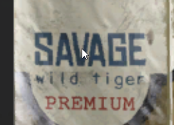

# IMMERSION CIGS MOD by KLPQ.io

## Overview
- https://www.youtube.com/watch?v=MPvKR3VtrEI

This mod adds an ability to smoke cigarettes.
While smoking, the cig will change it's model to a smaller version disappearing in the end (around 5 minutes) and producing smoke while it's active.
Mod is fully multiplayer compatible so you will hear the sound of the matches from other players and you'll see the smoke coming from the cigarette synchronized between all clients.
I in no way encourage anyone to smoke in real life, I don't smoke irl, it's just a small addition that I thought would add some immersion.

For educational purposes. Do not use the content in your works without our explicit permission.

## Credits
- Rebel - configs, scripting.
- Facel - 3d models, textures.
- Panimala - icons, sounds.
- Overlord Zorn - Scripting, German Translation.
- prisonerMO - Scripting.

## Threads
- https://forums.bistudio.com/forums/topic/181841-immersion-cigs/

## Downloads
- https://github.com/rebelvg/immersion_cigs/releases
- http://steamcommunity.com/sharedfiles/filedetails/?id=753946944

## Dependencies
- CBA

### Requirements
- Latest ARMA 3

### Optionals
- ACE3

## Usage

### In-Game
Mod supports both vanilla and ACE interaction systems.

### Content
- Cigarettes
- Matches
- Lighter
- Cigars
- Lollipop
- Cig Pack
- Packed Lollipop

### Actions
- Light up a cig.
- Light up someones cig.
- Get cigarette from pack (vanilla requires pack to be located in the uniform).

### Functions
- ```[_unit] spawn murshun_cigs_fnc_start_cig;``` - makes unit smoke.


### notes to self
VN Lighter: vn_b_item_lighter_01
vn_b_item_cigs_01


"weapons_f_vietnam_c"